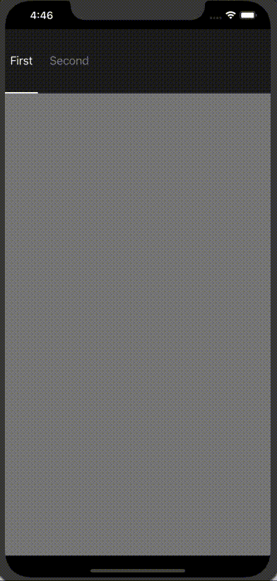

# TabPageView
Create pages with tabs 



### Requirements

You will need CocoaPods and also your project must be targeted fo iOS 10.3 or higher.

## Installation

TabPageView is available through [CocoaPods](https://cocoapods.org). To install
it, simply add the following line to your Podfile:

```ruby
pod 'TabPageView'
```

## How to use

1. Import the TabPageView

```swift 
import TabPageView
```

2. Configure the CalendarView:

```swift 
let firstView = UIViewController()
firstView.tabBarItem = UITabBarItem()
firstView.tabBarItem.title = "First"
        
let secondView = UIViewController()
secondView.tabBarItem = UITabBarItem()
secondView.tabBarItem.title = "Second"
        
tabPageView.viewControllers = [firstView, secondView]
 ```

3. You can use delegate to receiver actions
 ```swift
 self.tabPageView.delegate = self
 
 // Add that code below your class
 extension ViewController: TabPageViewDelegate {
    func tabPageSlidingView(didSelectTabAt index: Int) {
        
    }
}
```

#### How Customize your tabs

```swift
        
let attributes: [NSAttributedString.Key: Any] = [
     .font: UIFont.systemFont(ofSize: 18),
     .strokeColor: UIColor(red: 136/255, green: 136/255, blue: 136/255, alpha: 1)
]
        
let selectedAttributes: [NSAttributedString.Key: Any] = [
     .font: UIFont.systemFont(ofSize: 18),
     .strokeColor: UIColor.white
]

firstView.tabBarItem.setTitleTextAttributes(attributes, for: .normal)
firstView.tabBarItem.setTitleTextAttributes(selectedAttributes, for: .selected)
firstView.view.backgroundColor = .gray

tabPageView.appearance.distribution = .proportional
tabPageView.appearance.backgroundColor = UIColor(red: 31/255, green: 31/255, blue: 31/255, alpha: 1)
tabPageView.appearance.indicatorColor = .white
tabPageView.appearance.indicatorHeight = 2
tabPageView.appearance.tabHeight = 100
```

## Author
Felipe Remigio

*I will appreciate your contribution if you have any idea to improve this component*  

## License
*See the LICENSE file for more info*


